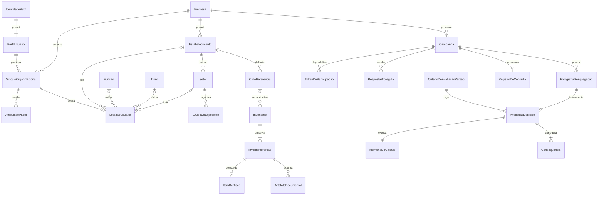

# Modelo conceitual do domínio

[ARQ] Modelo alvo consolidado pela Missão A; **não é schema SQL nem migração**. Referências empresariais incluem fronteira de empresa; perfil é global. Identificadores são opacos. Dados administrativos podem identificar autores; respostas não possuem pessoa/usuário associado. [Compatibilidade com o PDF complementar](compatibilidade-schemas.md) registra aproveitamento e divergências sem alterar os RFs.

## Entidades e relações

| Agregado / entidade | Conteúdo principal | Relações e invariantes |
| --- | --- | --- |
| Empresa | UUID, razão social/fantasia sintéticas, CNPJ/contatos opcionais, status e datas | 1:N estabelecimentos; fronteira do tenant |
| IdentidadeAuth | Identificador, e-mail e credencial gerenciados pelo Supabase Auth | Sem senha/hash/e-mail duplicados em tabelas próprias; verificação de sessão no servidor |
| PerfilUsuario | usuarioId referenciando Auth, nomeCompleto, status e datas | Um perfil por identidade; sem empresa global, credencial, matrícula, papel ou lotação |
| VinculoOrganizacional | UUID, usuário, empresa, matrícula opcional, status e datas | Um vínculo por usuário/empresa; matrícula preenchida única na empresa; nulo permitido |
| AtribuicaoPapel | Vínculo/empresa, papel, estado, concedente e datas | Catálogo de quatro papéis; múltiplos por vínculo, sem autoelevação |
| LotacaoUsuario | Vínculo/empresa, estabelecimento/setor/função/turno opcionais | Uma atual por vínculo; FKs da mesma empresa, setor do estabelecimento; histórico auditado |
| IdentificacaoProfissional | Titular, conselho/órgão, número/UF opcionais, estado de verificação | Não exige CPF público nem prova habilitação/assinatura por existir |
| Estabelecimento / Setor | Nome, localização/ambiente e processo | Empresa 1:N estabelecimento 1:N setor |
| Funcao / Turno / GrupoDeExposicao | Atividade, combinação organizacional, população esperada | Grupo pertence a um setor; função/turno opcionais quando não detalhados; partição sem sobreposição |
| EstruturaCongelada | Revisão e cópia dos grupos/populações | Campanha aponta para revisão imutável, não para cadastro vivo |
| Campanha | Janela, meta, escopo, situação e canal alternativo | 1:N grupos; uma versão do instrumento; gera registro de consulta |
| QuestionarioVersao / Pergunta | Fator, enunciado, escala e indicador de demonstração | Versão imutável após publicar campanha |
| TokenDeParticipacao | Hash, campanha, grupo, expiração e estado | Vários tokens por grupo; sem destinatário ou respostaId |
| RespostaProtegida | Campanha, grupo, instrumento, respostas e texto opcional | Sem tokenId, usuário, nome, IP ou timestamp preciso; acesso só pelo fluxo de agregação autorizado |
| RegistroDeConsulta | Data, escopo, adesão, divulgação e revisão | Derivado do encerramento; detalhe restrito e projeção divulgável |
| IndicadorComplementar | Tipo, valor, unidade, fonte e período | Setor e revisão; não armazena pessoa ou denúncia individual |
| FotografiaDeAgregacao | Versão, partição, k, escopo e estatísticas permitidas | Publicação imutável; contém somente projeções autorizadas |
| CriterioDeAvaliacaoVersao | Escalas, fórmula demo, células, faixas, decisões e estado | Matriz completa; versões publicadas não são editadas |
| CriterioAvaliacao / MatrizRisco / CelulaMatriz | Identidade estável, versão, configuração estruturada e cobertura das células | Configuração JSONB validada quando adequada; empresa/versão/FKs relacionais; célula sem faixa impede publicação |
| Aprovacao / EvidenciaDeAssinatura | Autor, data, versão, tipo e evidência | Aprovação acadêmica e assinatura formal são tipos distintos |
| LevantamentoPreliminar / MedidaRegistrada | Checklist, risco evidente, descrição e situação da medida | Bloqueia fechamento quando risco evidente sem medida; não é M4 |
| AvaliacaoDeRisco | Grupo/fator, perigo, consequências, S/P, AEP/AET, nível e decisão | Referencia fotografia M1, versão do critério e memória imutável |
| Consequencia | Descrição, magnitude, fundamento e determinante | Avaliação 1:N; determinante deve ter magnitude máxima |
| MemoriaDeCalculo | Entradas, operação, resultado, fontes, versão e instante | 1:1 resultado; persistência atômica |
| Decisao / JustificativaOverride | Decisão original/efetiva, motivo, autor, data e revisão | Não altera cálculo silenciosamente; mudança preserva a anterior |
| PerigoBibliotecaVersao | Descrição, fonte, circunstância e agravos | Itens contextualizados podem originar perigos na avaliação; edição não altera cópias históricas |
| InventarioGeralReferencia | PGR de referência, estabelecimento, versão e itens existentes | Base estruturada sintética do inventário integrado |
| CicloReferencia | UUID, empresa/estabelecimento, início, encerramento previsto e status | Associação opcional do inventário, mesma empresa/unidade; dependência conceitual E3/E4, sem implementar M5 ou prazo automático na E1 |
| Inventario / InventarioVersao / ItemDeRisco | Identidade estável; fotografia a–i, autor/data, origem e diferenças | Inventário 1:N versões; versão 1:N itens; consolidado imutável |
| ArtefatoDocumental | Tipo, versão, caminho privado, hash, data, situação | PDF de critérios ou inventário; sem sobrescrita; original e assinado relacionados |
| EventoDeAuditoria | Empresa, ator administrativo, ação, entidade, instante e resultado | Append-only na operação comum; sem respostas/tokens/texto livre |

Não existe aresta Token → Resposta ou Trabalhador → Resposta. Grupo/campanha são atributos compartilhados necessários à agregação, mas não autorizam consulta individual nem eliminam risco de correlação operacional.

Matrícula textual pertence ao vínculo, permite valores diferentes entre empresas e preserva zeros iniciais. No alvo revisado ela é opcional. Lotação não define automaticamente população de campanha e nunca é copiada para resposta individual. A [migração anterior](../../supabase/migrations/20260926000100_c0_usuarios_e_vinculos.sql) continua **não aplicada e requer adaptação**: ainda tem três papéis, matrícula obrigatória e lotação embutida. Chaves, índices e transição em [modelo de identidade](modelo-identidade.md).

## Configuração, resultados e versões

M1 preserva TokenDeParticipacao, QuestionarioVersao/Pergunta e RespostaProtegida, mesmo omitidos no quadro resumido do PDF complementar. `ResultadoAgregado` é a projeção publicável/suprimida por campanha/grupo/fator de uma FotografiaDeAgregacao versionada; nunca substitui token único, registro de consulta ou supressão de complementos.

Em M2, JSONB pode guardar escalas/configuração versionada e snapshot completo da memória. Validar formato, valores, cobertura das células, fórmula e versão. Empresa, critério/versão, grupo, documento e demais referências ficam em colunas com FKs; consequências e decisões consultáveis preservam estrutura própria. Matriz alterada não recalcula avaliação antiga. Nenhuma faixa do PDF complementar substitui o modelo demonstrativo de ADR-03.

Em M3, Perigo, FontePerigo, CircunstanciaGeradora, Agravo, GrupoExposto e MedidaPrevencao compõem itens estruturados/versões do inventário; não são diagnósticos de pessoas. `AlteracaoInventario` registra diferenças/autor/data. Cada versão consolidada tem inventário, número único por inventário, empresa/estabelecimento, responsável técnico designado e data; artefatos vinculados guardam hash dos bytes, caminho privado e evidência/estado de assinatura quando existentes. Hash e assinatura são distintos. Retenção e nove alíneas não se resumem à linha de arquivo PDF.

CicloReferencia não impõe dependência de M5 para rascunhos/inventários: associação é opcional e só será materializada em etapa autorizada para o suporte E3/E4. M4 Ação/Evidência, M5 Aferição e M6 Comunicado/Recibo são propostas futuras; relações por empresa e versão serão preservadas, sem tabelas nesta auditoria ou E1. Área pessoal do trabalhador permanece P-12, sem relação nominal com M1.

## Estados e fronteiras transacionais

Campanha: `rascunho → publicada → encerrada`; cancelamento é evento administrativo com motivo, sem apagar histórico. Fim da janela impede novos envios mesmo antes do fechamento administrativo. Encerramento e registro documental são atômicos. Sem consulta documentada, não liberar insumo conclusivo para M2.

Critérios: `rascunho → documentoGerado → aprovadoParaDemonstracao`. Assinatura tem trilha separada `semAssinatura → evidenciaRecebida → assinaturaVerificada`, disponível apenas quando P-06 for resolvida. Critérios do cálculo precisam ter aprovação anterior. Alteração abre nova versão pendente; versões antigas preservam seus estados históricos.

Avaliação: `rascunho → calculada → classificada → fechadaParaDemonstracao`. Travas de consequências, memória, AEP/AET, preliminar e recorte seguro valem no fechamento. Insumos alterados geram nova revisão. Avanço formal é uma autorização separada, inexistente na demonstração sem assinatura válida.

Inventário: `rascunho → consolidado`. Consolidação é imutabilidade técnica, não assinatura nem certificação. Nova versão parte de cópia do consolidado. Documento: `solicitado → gerado` ou `falhou`; assinatura é estado separado. PDF demonstrativo pode ser gerado sem liberar ciclo formal.

Transações críticas: consumo de token + resposta; encerramento + registro; resultado + memória + decisão; nova versão + diferenças + auditoria. PostgreSQL e Storage não compartilham transação: usar estado de geração durável, chave de objeto imutável e tentativa idempotente. Só marcar gerado após upload e hash confirmados. Falha/repetição não pode substituir PDF anterior.

## Retenção e exclusão

Arquivamento de cadastros não elimina referências históricas. Versões consolidadas, diferenças, critérios utilizados e artefatos têm preservação conjunta. Nenhuma cascata de exclusão de empresa pode remover esse conjunto. Respostas e tokens possuem política separada, ainda pendente para uso real; não herdam automaticamente retenção de 20 anos.
