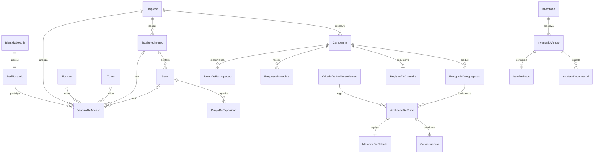

# Modelo conceitual do domínio

[ARQ] Modelagem para implementação posterior; **não é schema SQL nem migração**. Referências entre entidades sempre incluem fronteira de empresa. Identificadores são opacos. Dados administrativos podem identificar autores; respostas não possuem pessoa/usuário associado.

## Entidades e relações

| Agregado / entidade | Conteúdo principal | Relações e invariantes |
| --- | --- | --- |
| Empresa | Identificador e nome fictício | 1:N estabelecimentos; fronteira do tenant |
| IdentidadeAuth | Identificador, e-mail e credencial gerenciados pelo Supabase Auth | Sem senha/hash/e-mail duplicados em tabelas próprias; verificação de sessão no servidor |
| PerfilUsuario | usuarioId referenciando Auth, nomeCompleto | Um perfil por identidade; não contém matrícula nem dados de respostas |
| VinculoDeAcesso | Usuário, empresa, matrícula funcional, papel, ativo e lotação opcional | N:M usuários/empresas; um vínculo por usuário/empresa, matrícula única dentro da empresa; permissões administradas no servidor |
| Estabelecimento / Setor | Nome, localização/ambiente e processo | Empresa 1:N estabelecimento 1:N setor |
| Funcao / Turno / GrupoDeExposicao | Atividade, combinação organizacional, população esperada | Grupo pertence a um setor; função/turno opcionais quando não detalhados; partição sem sobreposição |
| EstruturaCongelada | Revisão e cópia dos grupos/populações | Campanha aponta para revisão imutável, não para cadastro vivo |
| Campanha | Janela, meta, escopo, situação e canal alternativo | 1:N grupos; uma versão do instrumento; gera registro de consulta |
| QuestionarioVersao / Pergunta | Fator, enunciado, escala e indicador de demonstração | Versão imutável após publicar campanha |
| TokenDeParticipacao | Hash, campanha, grupo, expiração e estado | Vários tokens por grupo; sem destinatário ou respostaId |
| RespostaProtegida | Campanha, grupo, instrumento, respostas e texto opcional | Sem tokenId, usuário, nome, IP ou timestamp preciso; acesso só pelo fluxo de agregação autorizado |
| RegistroDeConsulta | Data, escopo, adesão, divulgação e revisão | Derivado do encerramento; detalhe restrito e projeção divulgável |
| IndicadorComplementar | Tipo, valor, unidade, fonte e período | Setor e revisão; não armazena pessoa ou denúncia individual |
| FotografiaDeAgregacao | Versão, partição, k, escopo e estatísticas permitidas | Publicação imutável; contém somente projeções autorizadas |
| CriterioDeAvaliacaoVersao | Escalas, fórmula demo, células, faixas, decisões e estado | Matriz completa; versões publicadas não são editadas |
| Aprovacao / EvidenciaDeAssinatura | Autor, data, versão, tipo e evidência | Aprovação acadêmica e assinatura formal são tipos distintos |
| LevantamentoPreliminar / MedidaRegistrada | Checklist, risco evidente, descrição e situação da medida | Bloqueia fechamento quando risco evidente sem medida; não é M4 |
| AvaliacaoDeRisco | Grupo/fator, perigo, consequências, S/P, AEP/AET, nível e decisão | Referencia fotografia M1, versão do critério e memória imutável |
| Consequencia | Descrição, magnitude, fundamento e determinante | Avaliação 1:N; determinante deve ter magnitude máxima |
| MemoriaDeCalculo | Entradas, operação, resultado, fontes, versão e instante | 1:1 resultado; persistência atômica |
| PerigoBibliotecaVersao | Descrição, fonte, circunstância e agravos | Itens contextualizados podem originar perigos na avaliação; edição não altera cópias históricas |
| InventarioGeralReferencia | PGR de referência, estabelecimento, versão e itens existentes | Base estruturada sintética do inventário integrado |
| Inventario / InventarioVersao / ItemDeRisco | Identidade estável; fotografia a–i, autor/data, origem e diferenças | Inventário 1:N versões; versão 1:N itens; consolidado imutável |
| ArtefatoDocumental | Tipo, versão, caminho privado, hash, data, situação | PDF de critérios ou inventário; sem sobrescrita; original e assinado relacionados |
| EventoDeAuditoria | Empresa, ator administrativo, ação, entidade, instante e resultado | Append-only na operação comum; sem respostas/tokens/texto livre |

Não existe aresta Token → Resposta ou Trabalhador → Resposta. Grupo/campanha são atributos compartilhados necessários à agregação, mas não autorizam consulta individual nem eliminam risco de correlação operacional.

Atualização C0 de 2026-09-26: matrícula é textual e pertence ao vínculo, permitindo valores diferentes em empresas distintas e preservando zeros iniciais. Todas as referências de lotação incluem a mesma empresa; setor também referencia seu estabelecimento. Lotação administrativa não define automaticamente população de campanha e nunca é copiada para resposta individual. A migração local correspondente está preparada, **não aplicada**, em [C0 usuários](../../supabase/migrations/20260926000100_c0_usuarios_e_vinculos.sql).

## Estados e fronteiras transacionais

Campanha: `rascunho → publicada → encerrada`; cancelamento é evento administrativo com motivo, sem apagar histórico. Fim da janela impede novos envios mesmo antes do fechamento administrativo. Encerramento e registro documental são atômicos. Sem consulta documentada, não liberar insumo conclusivo para M2.

Critérios: `rascunho → documentoGerado → aprovadoParaDemonstracao`. Assinatura tem trilha separada `semAssinatura → evidenciaRecebida → assinaturaVerificada`, disponível apenas quando P-06 for resolvida. Critérios do cálculo precisam ter aprovação anterior. Alteração abre nova versão pendente; versões antigas preservam seus estados históricos.

Avaliação: `rascunho → calculada → classificada → fechadaParaDemonstracao`. Travas de consequências, memória, AEP/AET, preliminar e recorte seguro valem no fechamento. Insumos alterados geram nova revisão. Avanço formal é uma autorização separada, inexistente na demonstração sem assinatura válida.

Inventário: `rascunho → consolidado`. Consolidação é imutabilidade técnica, não assinatura nem certificação. Nova versão parte de cópia do consolidado. Documento: `solicitado → gerado` ou `falhou`; assinatura é estado separado. PDF demonstrativo pode ser gerado sem liberar ciclo formal.

Transações críticas: consumo de token + resposta; encerramento + registro; resultado + memória + decisão; nova versão + diferenças + auditoria. PostgreSQL e Storage não compartilham transação: usar estado de geração durável, chave de objeto imutável e tentativa idempotente. Só marcar gerado após upload e hash confirmados. Falha/repetição não pode substituir PDF anterior.

## Retenção e exclusão

Arquivamento de cadastros não elimina referências históricas. Versões consolidadas, diferenças, critérios utilizados e artefatos têm preservação conjunta. Nenhuma cascata de exclusão de empresa pode remover esse conjunto. Respostas e tokens possuem política separada, ainda pendente para uso real; não herdam automaticamente retenção de 20 anos.
