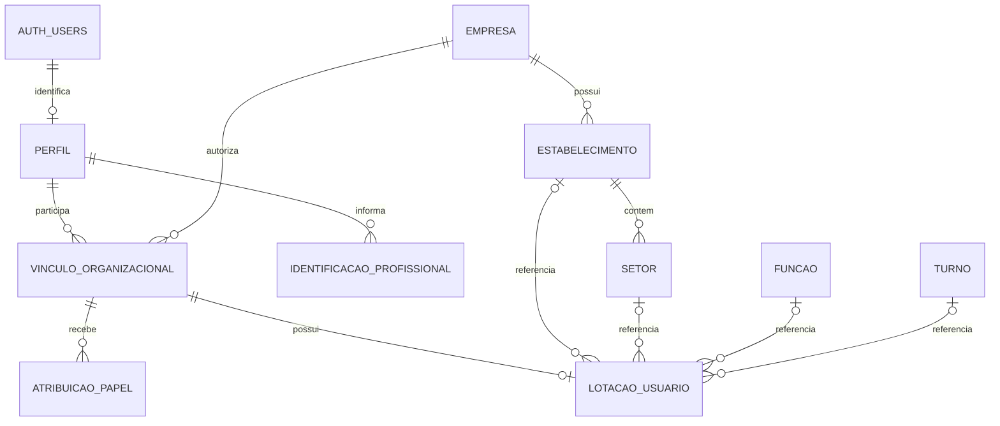

# Identidade única e vínculos por empresa

Modelo consolidado e implementado na E1, 2026-09-27. [MISSÃO] Supabase Auth é o provedor exclusivo. [ARQ] Estrutura física e execução em [Camada 0](execucao-camada-zero.md); aplicação local não equivale à aplicação remota. Os RFs originais permanecem intactos.

## Responsabilidades e cardinalidades

A sequência ilustrativa do prompt não significa que a lotação dependa de um papel: atribuições e lotação referenciam diretamente o vínculo. Remover um papel não apaga a lotação nem a história. Não existe relação com respostas ou tokens do M1.

## Chaves, atributos e restrições planejadas

Nomes físicos abaixo correspondem à migração consolidada, aplicada somente no ambiente local. UUID é identificador interno, não documento civil.

| Entidade | Identificação e dados | Restrições e índices |
| --- | --- | --- |
| `auth.users` | UUID, e-mail, credenciais e estado de autenticação sob responsabilidade Auth | Reutilizar a conta ao adicionar empresa; não copiar hash/senha para schema próprio; não tentar identificar pessoa por igualdade de nome |
| `perfis` | `id` PK/FK para Auth; nome completo; status `pendente/ativo/inativo`; `criado_em`, `atualizado_em` UTC | Sem empresa, matrícula, lotação, papel ou credenciais; nome 3–150 caracteres; status nunca alterável pelo próprio usuário para ganhar acesso |
| `vinculos_organizacionais` | UUID PK; `empresa_id`, `usuario_id`, matrícula opcional, status e datas UTC | FK para empresa e perfil; UNIQUE(empresa, usuário), UNIQUE(empresa,id); índice por usuário/status/empresa; vínculo histórico inativo é reativado de modo autorizado, não duplicado |
| `atribuicoes_papel` | UUID PK; empresa, vínculo, papel, status, concedente, datas de concessão/revogação e motivo | FK(empresa,vínculo) para vínculo; papel limitado ao catálogo fechado; UNIQUE parcial(empresa,vínculo,papel) quando ativo; índice por empresa/vínculo/status; revogação preserva evento e histórico |
| `lotacoes_usuario` | UUID PK; empresa, vínculo; estabelecimento/setor/função/turno opcionais; datas UTC | Uma lotação atual por vínculo: UNIQUE(empresa,vínculo); FKs compostas da mesma empresa, setor também do estabelecimento; setor exige estabelecimento; alterações auditadas, sem recalcular população ou campanhas antigas |
| `identificacoes_profissionais` | UUID PK; usuário; conselho/órgão, número e UF quando aplicáveis; datas e estado de verificação separado | FK para perfil; dados opcionais e acesso restrito; ausência não impede conta; possuir registro não prova habilitação; não criar CPF público ou obrigatório |

Matrícula é string de até 50 caracteres; preservar zeros iniciais, aparar espaços externos e normalizar vazio para NULL. Índice único parcial implementado `(empresa_id, lower(matricula)) WHERE matricula IS NOT NULL`. Permitir múltiplas contas sem matrícula na mesma empresa e valores iguais em empresas diferentes. Conta inicial pode existir sem vínculo; isso não concede acesso empresarial. Não fundir identidades existentes automaticamente por e-mail/nome: reconciliação é controlada.

Empresa, estabelecimento, setor, função, turno e grupo possuem UUID PK; entidades empresariais também oferecem UNIQUE(empresa,id) para FKs compostas. Setor oferece UNIQUE(empresa,estabelecimento,id). Índices nos lados filhos acompanham os caminhos de empresa/pai usados nas consultas. Detalhes de estrutura na [SPEC C0](../../specs/camada-0/estrutura-organizacional.spec.md).

Exclusões de Auth, perfil, empresa e referências históricas usam restrição; desativar/arquivar sem cascata destrutiva. Datas e autor administrativo vêm do servidor. Eventos de identidade e permissão não registram credenciais e não apontam para respostas anônimas.

## Quatro papéis e consultoria

Catálogo: `trabalhador`, `gestor_sst_rh`, `responsavel_tecnico`, `consultoria`. Múltiplos papéis por vínculo são permitidos para quem exerce mais de uma função; isso evita contas duplicadas e permite consultoria com atribuições específicas por cliente. As operações permitidas vêm da [matriz explícita](matriz-permissoes.md), não de inferência pelo nome do papel. Denegação de empresa/perfil/vínculo inativo e regras de negócio prevalecem sobre qualquer combinação de papéis.

`consultoria` isoladamente permite a carteira dos vínculos autorizados e a leitura do contexto mínimo desses clientes. Para gerenciar campanhas em A ou atuar tecnicamente em B, precisa respectivamente das atribuições `gestor_sst_rh` em A ou `responsavel_tecnico` em B. Um contrato poderá fundamentar a concessão, mas não é credencial global nem cria automaticamente acesso a todos os clientes. A carteira não une agregados, matrículas ou documentos de empresas diferentes.

`trabalhador` acessa o próprio perfil básico; não recebe diretório de colegas, campanha administrativa ou resultados por padrão. Conta pessoal futura de M4 não será condição de participação em M1. O cadastro de responsável técnico não equivale a assinatura nem comprovação de habilitação. Administrador de infraestrutura é identidade operacional segregada, fora do catálogo funcional, sem painel global nesta etapa.

## Transição do código preservado

| Implementação parcial encontrada | Adaptação necessária na E1 |
| --- | --- |
| `perfis_usuarios` com nome | Acrescentar estado/datas, reconciliação de contas preexistentes e leitura/edição restrita do próprio perfil |
| `vinculos` com chave empresa/usuário, `papel` único e matrícula obrigatória | Preservar identidades e relações; adotar UUID do vínculo, matrícula nullable e atribuições em tabela separada |
| `gestor`, `tecnico`, `leitor` | Propor mapeamento revisado `gestor` → `gestor_sst_rh`, `tecnico` → `responsavel_tecnico`; `leitor` não tem equivalência automática, exige decisão por vínculo sem elevar acesso |
| Lotação embutida no vínculo | Transferir para lotação independente e preservar referências/auditoria |
| DTOs e frontend exigem matrícula e um papel | Atualizar contratos, validação, formulário, seleção de empresa e testes juntos; não renomear apenas o banco |
| Trigger exige nome nos metadados em toda criação Auth | Testar criação controlada, contas anteriores e falha/reconciliação; metadados nunca concedem privilégios |

A inspeção remota confirmou que o SQL anterior não foi aplicado. Ele e seus testes foram arquivados em `historico/`; a pasta de migrações contém somente a inicial consolidada E1. O código foi adaptado ao modelo acima, sem conversão automática de `leitor`. Em outro ambiente já migrado, exigir evolução incremental. Ver ADR-15.

Auth e banco de negócio não têm commit distribuído. Preservar tratamento de cadastro parcial, identificador para reconciliação e ausência de compensação que conceda acesso. Ativação da conta e confirmação de e-mail precisam de fluxo controlado, sem marcar confirmação artificialmente.
