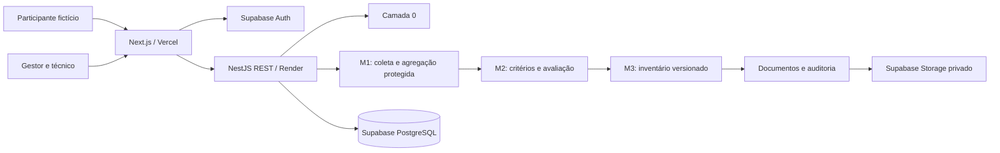

# Visão geral da arquitetura

## Decisão e escopo

[MISSÃO] Monorepositório pnpm existente. Frontend Next.js App Router, React, TypeScript strict, Tailwind CSS e shadcn/ui. Backend NestJS, TypeScript strict, REST, Swagger e Jest. Supabase PostgreSQL/Auth/Storage; Git/GitHub; Vercel/Render planejados. **São escolhas arquiteturais, não exigências dos PDFs.** E0 concluída, dependências fixadas no lockfile; recorte C0 parcial preservado. Missão A consolida arquitetura e aguarda autorização para E1 revisada.

[ARQ] Monólito modular NestJS: uma implantação e um banco, com limites internos explícitos. Sem microsserviços, Redis, broker ou servidor MCP próprio. Processos de exportação idempotentes podem usar registros duráveis no mesmo PostgreSQL; não depender da memória de uma instância gratuita.



## Camadas e direção das dependências

| Camada | Responsabilidade | Restrições |
| --- | --- | --- |
| Domínio | Entidades, valores, invariantes, cálculo e políticas | TypeScript puro; sem NestJS, HTTP, SDK Supabase ou SQL |
| Aplicação | Casos de uso, autorização contextual, transações, portas | Depende do domínio; declara interfaces de repositório, relógio, hash e documentos |
| Infraestrutura | Adaptadores PostgreSQL, Auth, Storage, PDF e logs | Implementa portas; concentra detalhes externos |
| Apresentação | Controllers, DTOs, Swagger e conversão de erros | Sem regras de domínio; chama casos de uso |

Imports apontam para o interior. Módulo NestJS faz composição/injeção; não exportar repositórios internos para outro módulo. Domínio decide a trava, aplicação controla a operação e persistência reforça invariantes críticas. Frontend valida para orientar o usuário; autoridade final permanece no backend.

## Capacidades e proprietários

| Módulo | Responsabilidade e dados próprios | Interfaces principais |
| --- | --- | --- |
| Organizações | Empresa, estrutura, populações e vínculos de acesso | Obter escopo autorizado; congelar estrutura |
| Campanhas | Janela, meta, estados, divulgação, canal e registro de consulta | Criar/publicar/encerrar campanha |
| Anonimato | Tokens, consumo único, supressão, partições e fotografias | Validar participação; obter agregado publicável |
| Questionários | Versão do instrumento, validação e respostas protegidas | Receber resposta sem identidade; fornecer somente ao agregador |
| Indicadores | Valores objetivos, unidade, fonte e período | Registrar/revisar indicador; fornecer procedência |
| Critérios de avaliação | Escalas, matriz, faixas, decisões e aprovação | Publicar versão completa; consultar versão imutável |
| Avaliações | Preliminar, consequências, AEP/AET, cálculo e decisão | Avaliar fator; fornecer pacote para inventário |
| Inventários | Biblioteca, integração geral, a–i, versões/diferenças e retenção | Consolidar; criar revisão; exportar formato aberto |
| Documentos | PDF, objetos privados, hashes e estados de assinatura | Gerar artefato; verificar integridade; autorizar download |
| Auditoria | Eventos administrativos e histórico de operações | Registrar evento sanitizado; consultar trilha autorizada |

Autenticação/autorização são capacidades transversais de suporte; não acrescentam RF documental. Ações futuras M4–M6 não têm módulos implementados ou requisitos inventados.

Identidade única e quatro papéis são detalhados em [modelo de identidade](modelo-identidade.md), [matriz](matriz-permissoes.md) e [isolamento](isolamento-multiempresa.md). O [PDF complementar](compatibilidade-schemas.md) contribui com modelagem, sem substituir os 21 RFs. Ciclo é referência conceitual futura, não máquina M5 implementada na E1.

## Organização futura por capacidades

A árvore abaixo é proposta de evolução. Hoje existem `apps/web`, `apps/api` com camadas diretamente em `src`, contratos e uma migração C0 não aplicada. Não recriar o workspace nem mover código por mera preferência estrutural.

```text
apps/
  web/src/app/                 # rotas Next.js e composição de telas
  web/src/funcionalidades/     # fluxos por capacidade
  api/src/modulos/<capacidade>/
    dominio/
    aplicacao/
    infraestrutura/
    apresentacao/
packages/
  contratos/                  # DTOs públicos e schemas; sem entidades de persistência
  configuracao/               # TypeScript/lint compartilhados se houver repetição real
supabase/migrations/          # somente na etapa de implementação
specs/                        # contratos de comportamento
docs/                         # fontes, decisões, evidências e backlog
.agents/skills/               # três fluxos locais do Codex
```

Não criar pacote compartilhado de domínio prematuramente. Em vez de importação cruzada de entidades, usar portas/contratos dos módulos. Nomes obrigatórios `page.tsx`, `layout.tsx`, `Controller`, `Module`, `Request` etc. permanecem conforme APIs.

## Persistência e acesso

[ARQ] Adaptador PostgreSQL parcial já usa `pg`, SQL parametrizado e transações explícitas; conexão de runtime/RLS ainda não validada. Sem ORM obrigatório. Modelo alvo requer revisão da migração anterior, não aplicada. Login comum não pode ser proprietário ou BYPASSRLS. Nest verifica identidade e vínculo/atribuições ativos; RLS reforça capacidades por operação. Futura rota anônima de coleta terá privilégio estrito de consumir código/gravar resposta sem identificar pessoa. Ver [segurança](seguranca-privacidade.md).

## Publicação acadêmica futura

Vercel Hobby tem restrição a uso pessoal não comercial; confirmar enquadramento da demonstração antes do deploy. Não assumir que o SaaS comercial poderá permanecer nesse plano. [Documentação Vercel](https://vercel.com/docs/plans/hobby).

Render gratuito pode suspender por inatividade e perde arquivos locais em reinicializações. PDFs devem persistir no Storage e tarefas precisam sobreviver a reinícios. Não prometer disponibilidade de produção. [Documentação Render](https://render.com/docs/free).

Planejar exportação do banco e dos objetos separadamente: backup de banco não inclui bytes dos objetos Storage; plano gratuito requer estratégia própria de backup. A guarda por 20 anos continua pendência operacional. [Backups Supabase](https://supabase.com/docs/guides/platform/backups).

Estas condições foram consultadas na preparação inicial e precisam ser reconferidas antes da publicação. O projeto Supabase já foi vinculado por autorização explícita, com credenciais somente nos ambientes locais ignorados; isso não constitui deploy nem validação de RLS. Regiões/cotas/termos, domínios, custos e publicação continuam pendentes. Falhas de rede/PDF não devem avançar estados de negócio.
